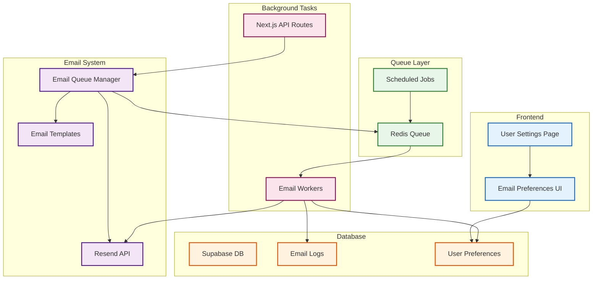
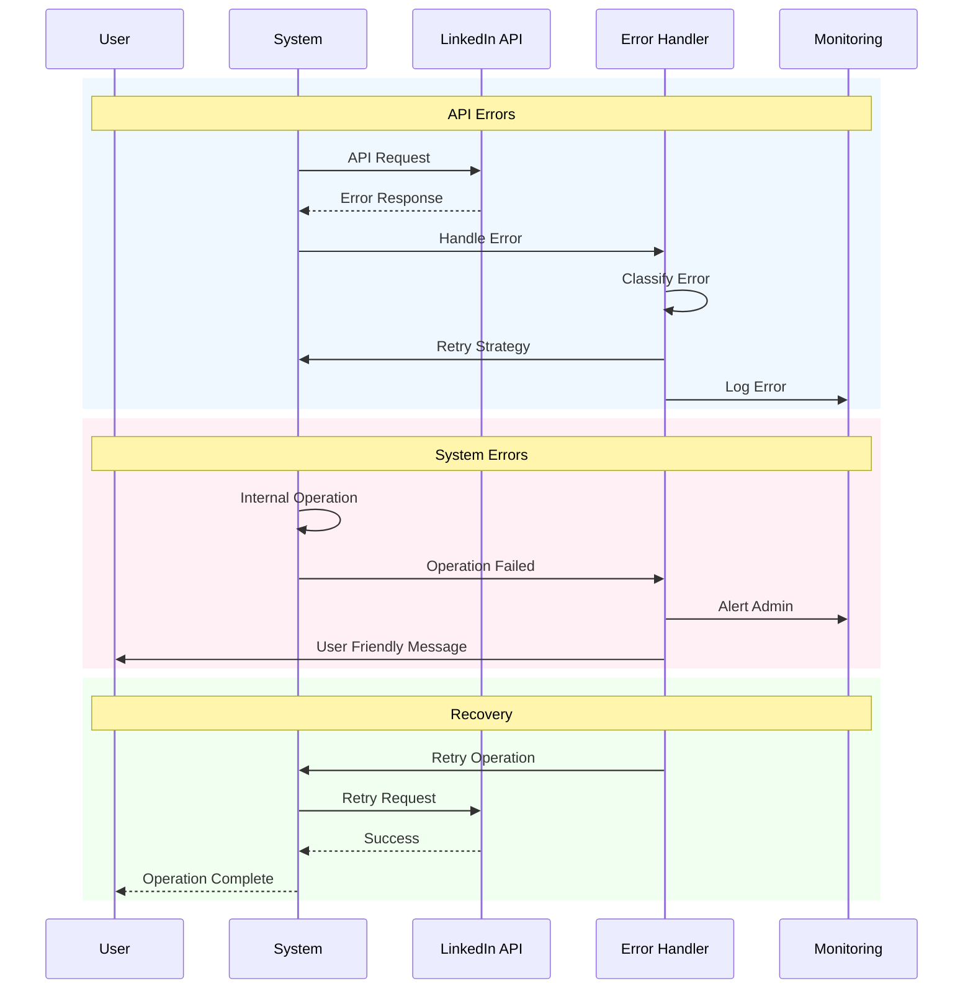
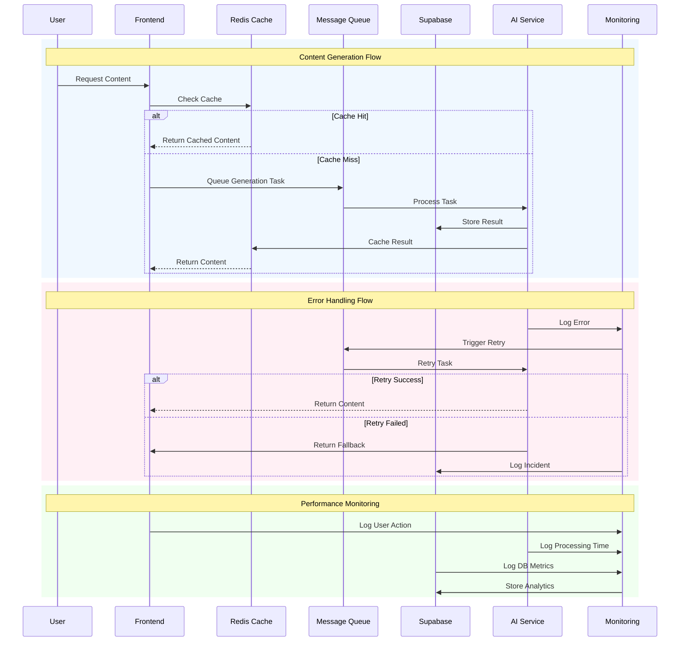
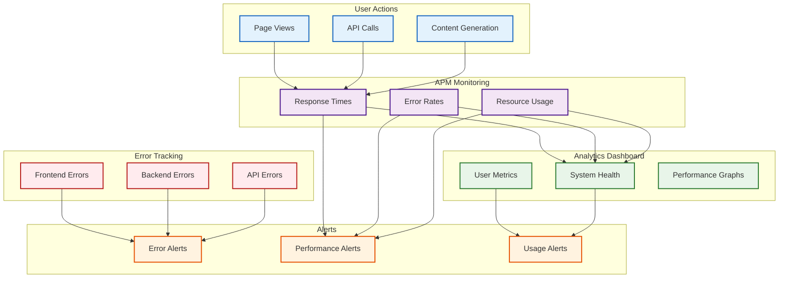
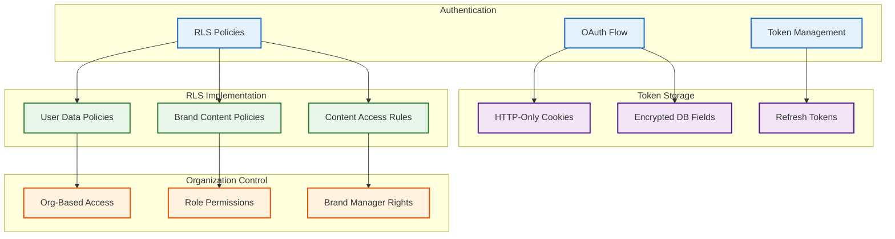

# Ghostart System Architecture

## 1. Core Database Schema
Ghostart's database is built on **Supabase (PostgreSQL)** with **Row-Level Security (RLS)** policies to ensure data isolation.

### **Organizations Table**
```sql
CREATE TABLE organizations (
    id uuid DEFAULT uuid_generate_v4() PRIMARY KEY,
    name text NOT NULL,
    settings jsonb DEFAULT '{}'::jsonb,
    created_at timestamptz DEFAULT now()
);
```

### **User Organizations (Junction Table)**
```sql
CREATE TABLE user_organizations (
    user_id uuid REFERENCES auth.users,
    organization_id uuid REFERENCES organizations,
    role text NOT NULL CHECK (role IN ('admin', 'brand_creator', 'employee')),
    PRIMARY KEY (user_id, organization_id)
);
```

### **Exercise Completion Table**
```sql
CREATE TABLE exercise_completion (
    user_id uuid REFERENCES auth.users,
    exercise_type text NOT NULL,
    completion_status text NOT NULL,
    data jsonb,
    completed_at timestamptz,
    PRIMARY KEY (user_id, exercise_type)
);
```

### **Example RLS Policies**
```sql
CREATE POLICY "org_member_read_access" ON organizations
    FOR SELECT
    USING (
        EXISTS (
            SELECT 1 FROM user_organizations
            WHERE user_id = auth.uid()
            AND organization_id = id
        )
    );

CREATE POLICY "admin_full_access" ON organizations
    FOR ALL
    USING (
        EXISTS (
            SELECT 1 FROM user_organizations
            WHERE user_id = auth.uid()
            AND organization_id = id
            AND role = 'admin'
        )
    );
```

---

## 2. System Architecture

### **Frontend (Vercel - Next.js App Router)**
- **Protected & Public Routes**
- **Edge Caching** for Static Content & API Responses
- **Live Post Preview System** mimicking LinkedIn UI

### **Backend (Supabase)**
- **Authentication System (OAuth + JWT)**
- **PostgreSQL Database**
- **Row-Level Security (RLS)**
- **Automated Database Updates via AI Tools**

### **Caching Layer (Redis)**
- **User Data Cache** (profile information, preferences, exercise responses)
- **Content Cache** (generated posts, templates, training materials)
- **Analytics Cache** (performance metrics, engagement stats, system health data)

### **Queue System**
- **Message Queue** for content generation tasks, analytics processing, email notifications
- **Task Scheduler** for scheduled posts, data aggregation, cache invalidation

### **AI Services (Render - Python)**
- **Background Workers**
- **Retry Mechanisms & Fallback Systems**
- **AI-powered Content Generation via OpenAI API**

---

## 3. External Services Integration
- **LinkedIn API** → OAuth-based login, Post-sharing & analytics retrieval
- **Stripe API** → Payment processing for AI-generated content
- **Resend API** → Email automation for reminders, reports, and alerts

---

## 4. Security & Performance
- **JWT Authentication & OAuth Token Storage**
- **API Key Management & Rate Limiting**
- **DDoS Protection via Cloudflare**
- **SSL/TLS Encryption**
- **Database Backups & Disaster Recovery Plans**

---

## 5. Embedded Architecture Diagrams

### **Email System Architecture**


### **Error Handling System**


### **Ghostart Data Flows**


### **Ghostart Monitoring System**


### **Security Architecture**

